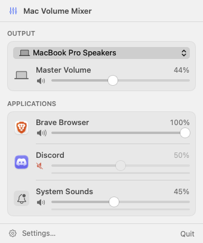
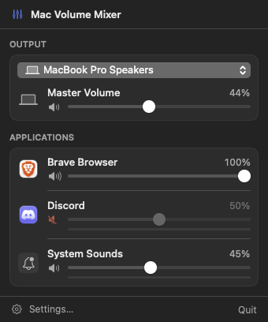

# Mac Volume Mixer

A macOS menu bar mixer with **independent volume and mute for each application** — the macOS
equivalent of the Windows Volume Mixer / EarTrumpet.

Changing Chrome's volume does not touch Spotify. Changing Spotify does not touch the system
master volume. This is real per-app attenuation, not a relabelled global volume control.

<p align="center">
  
  
</p>

## Download

Get the latest **`MacVolumeMixer-<version>.dmg`** from the
[Releases page](https://github.com/almuhannad1/mac-volume-mixer/releases/latest).
It is a universal app (Apple Silicon and Intel) for **macOS 14.2 or later**.

1. Open the DMG and drag **Mac Volume Mixer** onto **Applications**.
2. Open it from Applications. The first time, macOS blocks it (see below).
3. Allow **System Audio Recording** when asked, then click the fader icon in the menu bar.

### First launch: "Apple could not verify…"

Release builds are not notarized (that needs a paid Apple Developer account), so Gatekeeper stops
the first launch. This happens once:

- **macOS 15 Sequoia and later:** double-click the app, click **Done** on the warning, then open
  **System Settings → Privacy & Security**, scroll down to *"Mac Volume Mixer" was blocked…* and click
  **Open Anyway**, then confirm.
- **macOS 14 Sonoma:** right-click (or Control-click) the app in Applications, choose **Open**, then
  click **Open** in the dialog.

If you prefer the terminal, this removes the download quarantine flag instead:

```bash
xattr -dr com.apple.quarantine "/Applications/Mac Volume Mixer.app"
```

Each release lists SHA-256 checksums so you can confirm the download is intact
(`shasum -a 256 MacVolumeMixer-*.dmg`). Prefer to build it yourself? See [Build](#build).

## How it works, and why that matters

macOS has **no** API equivalent to Windows' `ISimpleAudioVolume` — nothing can set another
process's volume. What macOS 14.2 added is the missing primitive: a **Core Audio process tap**
can *mute* another process at the HAL and hand that process's audio to us instead.

```
Spotify ──(muted by our tap at the HAL)──╳──▶ speakers
   │
   └──▶ tap stream ──▶ private aggregate device ──(× gain)──▶ speakers
```

So the attenuation is performed by this app, in a realtime IOProc, using public APIs only. No
kernel extension, no virtual audio driver, no SIP changes, no private APIs, no code injection.

Apps left at 100 % and unmuted are **not tapped at all**: no extra latency, no CPU, no risk.

Full analysis, including the ranked alternatives and live API probes run on real hardware:
[docs/FEASIBILITY.md](docs/FEASIBILITY.md). Design and data flow: [docs/ARCHITECTURE.md](docs/ARCHITECTURE.md).

## Features

- **Per-app volume (0–100 %) and independent mute**, keyed by bundle identifier.
- **Master volume and mute** for the current output device.
- **Output device switching** (speakers, AirPods, USB, HDMI, virtual devices…).
- **Automatic app detection.** Apps appear as soon as they use audio and disappear 30 s after
  they stop. Helper processes (Chrome, Discord, Slack, VS Code) are grouped under the owning app.
- **Real peak meters** for apps being processed — measured from the tap, never synthesized from
  the slider value. Apps that are only playing (not processed) show a truthful "playing" marker.
- **Persistent volumes**, restored automatically when an app relaunches.
- **Search/filter** once six or more apps are listed.
- **Settings:** launch at login, menu bar icon, auto-open mixer, preferred output device,
  remember volumes, show inactive apps, permission status, about.
- **Event-driven**: Core Audio property listeners plus a single scheduled wake-up, no polling.
  Meters run at 20 Hz only while the panel is open. Idle taps stop their IO after 15 s.

## Requirements

- **macOS 14.2 or later** (process taps are `API_AVAILABLE(macos(14.2))`). Everything except
  per-app volume would work on older systems, but the app targets 14.2+.
- Swift 6 toolchain. Xcode is **not** required; Command Line Tools are enough.

## Build

```bash
swift build                      # build all targets
swift test                       # run the unit tests (35 tests)
swift scripts/make-app-icon.swift # regenerate Resources/AppIcon.icns (only if you change the icon)
scripts/build-app.sh             # produce build/Mac Volume Mixer.app (ad-hoc signed)
```

For a signed, notarizable build:

```bash
CODESIGN_IDENTITY="Developer ID Application: Your Name (TEAMID)" scripts/build-app.sh
```

The script adds the hardened runtime and a secure timestamp when a real identity is supplied.

To produce the downloadable packages (universal DMG and zip in `dist/`, with checksums):

```bash
scripts/package-release.sh
```

### Run

```bash
open "build/Mac Volume Mixer.app"
```

The app is a menu bar app (`LSUIElement`): it has no Dock icon. Click the speaker icon in the
menu bar to open the mixer. Launching the app again opens Settings — that is the way back if you
hide the menu bar icon.

Useful launch arguments:

| Argument | Purpose |
|---|---|
| `--disable-taps` | Safe mode: master volume, device switching and the app list work, but no taps are created. Handy for troubleshooting. |
| `--list-sessions` | Prints the output devices and detected audio sessions to stdout and exits. Creates no taps. |
| `--self-test` | Builds a real tap + aggregate device + IOProc against the current output device and releases it, without starting IO. Confirms the audio pipeline works; mutes nothing and prompts for nothing. |
| `--snapshot-panel <file.png> [--dark]` | Debug builds only: renders the panel offscreen for layout review. |

### Install as a normal Mac app

```bash
scripts/build-app.sh
cp -R "build/Mac Volume Mixer.app" /Applications/
open "/Applications/Mac Volume Mixer.app"
```

The bundle is self-contained (one binary, its icon and `Info.plist`, linking only system
frameworks), so it needs neither the source tree nor a toolchain once installed. Enable
*Settings → General → Launch at login* to start it with the Mac.

Replacing an ad-hoc signed bundle changes its signature, so macOS may ask for the System Audio
Recording permission again after an update; press **Check Again** in the panel afterwards.

## Using it

Once installed and granted permission:

| To do this | Do that |
|---|---|
| **Open the mixer** | Click the fader icon in the menu bar. There is no Dock icon. |
| **Change one app's volume** | Drag its slider. Nothing else changes — not other apps, not the system volume. |
| **Mute one app** | Click the speaker button to the left of its slider. |
| **Change the system volume** | Use the **Master Volume** slider at the top. |
| **Switch speakers/headphones** | Use the device menu at the top of the panel. |
| **Find an app in a long list** | The search field appears once six or more apps are listed. |
| **Reset one app** | Right-click its row → *Reset to 100%*. |
| **Reset everything** | Settings → Audio → *Reset All Application Volumes*. |
| **Start it with the Mac** | Settings → General → *Launch at login*. |
| **Get back if you hide the menu bar icon** | Open the app again from Spotlight; it reopens Settings. |

Apps appear on their own as soon as they play sound, and drop off the list about 30 seconds after
they stop (apps you have turned down or muted stay, so you can restore them). Volumes are
remembered per app and reapplied when the app relaunches.

Good to know:

- The first time you move an app off 100 %, there is a gap of about a tenth of a second while the
  tap engages. This happens once per app, not on every change.
- Apps left at 100 % are not processed at all, so they have zero added latency.
- Quitting Mac Volume Mixer instantly restores every app to normal — taps cannot outlive the app.

## Permissions

| Permission | Why | When it is requested | If denied |
|---|---|---|---|
| **System Audio Recording** (`NSAudioCaptureUsageDescription`, shown in *Privacy & Security → Screen & System Audio Recording*) | A process tap must read an app's audio to play it back attenuated. This is the only way to apply per-app volume. | On first launch, when the app runs its capture self-test. | Per-app volume and meters stay inactive and a banner explains why. **Master volume, mute and output switching keep working.** Your saved app volumes are kept and applied as soon as access is granted. |
| *Launch at login* (optional) | Only if you enable it; uses `SMAppService`, no helper binary. | When you toggle it. | Nothing else is affected. |

No Accessibility permission. No Screen Recording (video). No microphone. No admin rights. No
terminal commands.

**Why a self-test?** macOS exposes no public API for the System Audio Recording permission
status, and an unauthorized tap silently returns silence. Since the app mutes a tapped process,
engaging a tap without access would make the app silent. So at launch, Mac Volume Mixer taps
*itself*, plays an inaudible −90 dBFS tone, and only enables per-app control if that tone comes
back. Nothing is recorded or written to disk.

If the permission is granted after the prompt, press **Check Again** (or just reopen the panel).
Ad-hoc signed builds change identity on every rebuild, so macOS may ask again after each build.

## Known macOS limitations

These are platform limits, not missing work:

1. **macOS 14.2+ only** for per-app volume.
2. **Per-tab volume is impossible.** Chrome renders all tabs' audio in a single audio process, so
   macOS exposes one source for the whole browser.
3. **Safari and WebKit apps share one process** (`com.apple.WebKit.GPU`), listed honestly as
   "Safari & Web Content". Attributing it to a specific app needs a private API.
4. **Processed apps gain ≈10–20 ms latency** (one aggregate-device buffer, drift-compensated).
   Apps at 100 % are untouched.
5. **A short gap (~50–200 ms)** occurs when a tap engages or releases — i.e. the first time you
   move a slider off 100 %, and when you return it to 100 %.
6. **After an idle app resumes**, the first few tens of milliseconds may be lost while the tap's
   IO restarts. This is deliberate: a muted app can never blast at full volume.
7. **Hog-mode (exclusive) devices** can't be shared by an aggregate device.
8. **App Store distribution is unverified.** The MVP targets Developer ID.
9. If an app plays to a device other than the default, the engine follows that device; if an app's
   helpers disagree, the system default is used.

## Testing

Unit tests cover the non-UI logic: gain/ramp/channel mapping, volume curve, meter scale, app
identity resolution and helper grouping, tap and visibility policies, activity tracking, search,
persistence, device filtering and four-char-code formatting.

```bash
swift test
```

Audio behaviour cannot be verified without a person listening and granting the permission.
[docs/TESTING.md](docs/TESTING.md) is the manual test matrix (Safari, Chrome, Spotify, Discord,
VS Code, VLC, system sounds, device switching, AirPods, sleep/wake, restart).

## Project structure

```
Package.swift
Sources/
  RealtimeAtomics/      C atomics shared with the realtime thread
  MixerCore/            Pure Swift: DSP, models, policies, persistence (unit tested)
  AudioHAL/             Core Audio: devices, processes, taps, permission probe
  MacVolumeMixer/       AppKit shell + SwiftUI views, view models, orchestration
Tests/MixerCoreTests/
Resources/              Info.plist, entitlements
scripts/build-app.sh
docs/                   FEASIBILITY.md, ARCHITECTURE.md, TESTING.md
```

Dependency direction is strictly `App → AudioHAL → MixerCore → RealtimeAtomics`; MixerCore
imports neither Core Audio nor AppKit, which is what makes it testable headlessly.

## Future improvements

- **macOS 26 APIs:** `CATapDescription.bundleIDs` and `processRestoreEnabled` would let a tap
  follow an app by bundle ID across relaunches, removing the restart gap.
- **Volume boost above 100 %** with a limiter.
- **Per-app output device routing** (send Spotify to speakers and Discord to headphones) — the
  aggregate device already makes this possible.
- **Global hotkeys** and Now Playing integration.
- **Universal binary + notarized release** (needs full Xcode for `--arch` cross-building).
- **App icon and a first-run onboarding window** explaining the permission before the prompt.
- Tap-based metering for unprocessed apps, if measured cost proves negligible.
