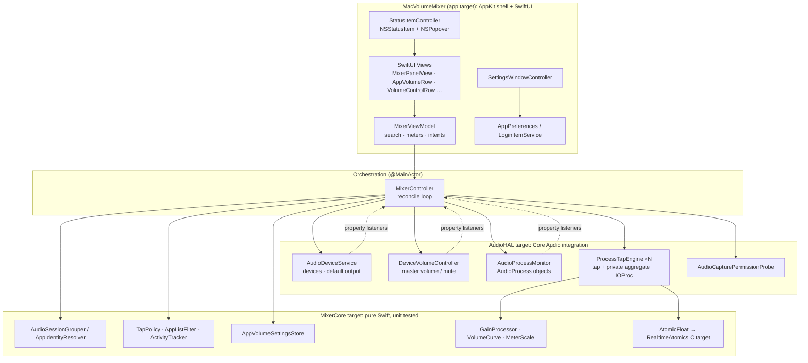
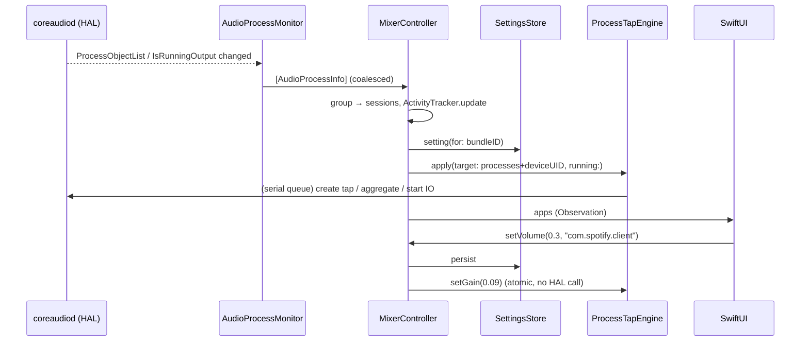

# Technical Design

## Overview



The dependency direction is strictly `App → AudioHAL → MixerCore → RealtimeAtomics`.
MixerCore has no Core Audio or AppKit imports, which is why it can be unit tested headlessly.

## Components

| Component | Target | Responsibility |
|---|---|---|
| `RealtimeAtomics` | C | Lock-free `_Atomic` float cells (`store`, `load`, `exchange`, `store_max`) shared between the render thread and the main thread. |
| `AtomicFloat` | MixerCore | Swift owner of an atomic cell. |
| `GainProcessor` | MixerCore | Realtime-safe interleaved Float32 copy with a linear gain ramp and pre-gain peak detection. Handles channel mapping (stereo → N channels, stereo → mono). |
| `VolumeCurve` | MixerCore | Slider value (0…1) → linear gain (`v²`, ≈ −12 dB at 50 %). Muted → 0. |
| `MeterScale` | MixerCore | Peak → 0…1 display level on a −60 dB…0 dB scale. |
| `AppIdentityResolver` | MixerCore | Process path/bundle ID → logical app. Outermost `.app` wins, so helpers group under their owner. Known system services (WebKit, system sounds) get a stable identity. |
| `AudioSessionGrouper` | MixerCore | `[AudioProcessInfo]` → `[AudioAppSession]`. Excludes our own PID, merges helpers, derives "is playing" and a preferred output device. |
| `AppVolumeSettingsStore` | MixerCore | Per-app `{volume, isMuted}` keyed by bundle ID, JSON in `UserDefaults`. Default values are pruned. Memory-only when "Remember application volumes" is off. |
| `TapPolicy` | MixerCore | When to tap (non-default setting **and** capture authorized) and when to run IO (playing, or within the idle grace period). |
| `ActivityTracker` / `AppListFilter` | MixerCore | "Recently active" linger, inactive-app visibility, search matching. |
| `AudioProcessMonitor` | AudioHAL | Listens to `kAudioHardwarePropertyProcessObjectList`, plus per-process `IsRunningOutput` and `Devices`. Coalesces events into one snapshot. |
| `AudioDeviceService` | AudioHAL | Output device list and default output, via listeners. Hides devices with no output, hidden devices, and our own aggregate devices. |
| `DeviceVolumeController` | AudioHAL | Master volume/mute of the default device. Uses `VirtualMainVolume` → main `VolumeScalar` → per-channel scalar fallback. |
| `ProcessTapEngine` | AudioHAL | One per processed app. Owns a serial queue on which it creates, updates, starts, stops and destroys its `TapResources`. Gain and peak cross threads only through atomics. |
| `AudioCapturePermissionProbe` | AudioHAL | Loopback self-test that detects whether taps deliver real audio (i.e. whether TCC access is granted). |
| `MixerController` | App | The orchestrator: merges process snapshots, device state, settings and permission into engine directives and the UI list. |
| `MixerViewModel` | App | Search text, per-row meter levels (20 Hz, only while the panel is visible), user intents. |
| Views | App | Small SwiftUI views. `VolumeControlRow` is shared by the master row and app rows. |

## Data flow



**Reconcile loop.** Every event (process change, device change, slider move, preference change,
permission result, timer) calls `MixerController.reconcile()`. The function is idempotent: it
computes the desired engine state for every session and only sends *changes* to engines. It
also schedules a single wake-up for the next deadline: idle-IO stop, disengage debounce, or
list linger expiry. There is no periodic polling.

## Audio processing flow

```mermaid
flowchart LR
    A[Spotify process] -->|output| HALMIX{{HAL mix}}
    TAP[[Process tap<br/>CATapDescription<br/>stereo mixdown · private · muteBehavior=.muted]]
    A -. captured .-> TAP
    HALMIX -. Spotify silenced .-> DEV[(Output device)]
    TAP --> AGG[Private aggregate device<br/>main sub-device = output device<br/>tap drift compensation on]
    AGG --> IO[IOProc on realtime thread<br/>GainProcessor: in × ramp(gain) → out<br/>peak → atomic]
    IO --> DEV
```

Per-app engine lifecycle:

1. **Engage.** Triggered when the setting becomes non-default and capture is authorized.
   - `AudioHardwareCreateProcessTap`
   - Verify the tap format is Float32.
   - `AudioHardwareCreateAggregateDevice` (private, not stacked, main sub-device = target output,
     tap list with drift compensation). The tap stream is the *last* input stream.
   - Verify the output stream format.
   - `AudioDeviceCreateIOProcIDWithBlock` with a `nil` queue, so the block runs on the HAL IO
     thread.
2. **Run.** `AudioDeviceStart` while the app is playing. Stop 15 s after it goes quiet.
3. **Update.** New helper process → set `kAudioTapPropertyDescription`, no rebuild. Output device
   changed → rebuild.
4. **Disengage.** Setting back to default for 2 s, or the app quit: `AudioDeviceStop` →
   `AudioDeviceDestroyIOProcID` → `AudioHardwareDestroyAggregateDevice` →
   `AudioHardwareDestroyProcessTap`.
5. **Wake from sleep.** All engines rebuild.

The render block is realtime-safe:

- It captures only raw pointers (`OpaquePointer` atomics and a ramp cell).
- It does no allocation, locking, logging, ARC or Objective-C messaging.
- The ramp prevents zipper noise when a slider moves.
- Buffers the engine does not own are zeroed.

## Swift classes (by file)

```
Sources/
  RealtimeAtomics/            RealtimeAtomics.c, include/RealtimeAtomics.h
  MixerCore/
    DSP/                      GainProcessor, VolumeCurve, MeterScale
    Models/                   AppIdentity, AppVolumeSetting, AudioAppSession, AudioOutputDevice, AudioProcessInfo
    Logic/                    AppIdentityResolver, AudioSessionGrouper, ActivityTracker, AppListFilter, TapPolicy, VolumeGlyph
    Persistence/              AppVolumeSettingsStore, SettingsPersistence
    Support/                  AtomicFloat, FourCharCode
  AudioHAL/
    Support/                  HAL (property access), PropertyListener, CoreAudioError, HALLog, HALConstants
    Devices/                  AudioDeviceService, DeviceVolumeController
    Processes/                AudioProcessMonitor
    Taps/                     ProcessTapEngine, TapResources, AudioCapturePermissionProbe
  MacVolumeMixer/
    App/                      main, AppDelegate, StatusItemController, SettingsWindowController, Diagnostics
    Services/                 MixerController, AppPreferences, LoginItemService, AppIconProvider, ObservationLoop
    ViewModels/               MixerViewModel, MeterBank
    Views/                    MixerPanelView, OutputSectionView, ApplicationsSectionView, AppVolumeRow,
                              VolumeControlRow, ActivityMeterView, PermissionBannerView, SearchField, CardStyle
    Views/Settings/           SettingsView, GeneralSettingsView, AudioSettingsView, AboutSettingsView
```

## Concurrency model

| Domain | What runs there |
|---|---|
| `@MainActor` | Controller, services, listeners (registered on `DispatchQueue.main`), view models, views. |
| Engine serial queues | All HAL mutations for taps and aggregates. Each engine has its own queue (targeting one shared queue), so a slow `AudioDeviceStart` never blocks the UI and commands stay ordered. Queue blocks retain the engine, so the atomics the IOProc points to outlive the IOProc. |
| HAL IO thread | The render block only. |
| Probe queue | The permission self-test, bridged to `async` with a checked continuation. |

Termination calls `shutdownAndWait()`, which tears down every engine synchronously. Muting taps
therefore never outlive the app, and private taps and aggregates are reclaimed by the HAL
when the process exits anyway.

## UI architecture

- **AppKit shell.** `NSStatusItem` plus a transient `NSPopover` hosting SwiftUI
  (`sizingOptions = .preferredContentSize`). `MenuBarExtra` was rejected because it cannot be
  opened programmatically ("Open mixer at launch") or reliably hidden.
- **SwiftUI content.** Observation (`@Observable`) models. Each row observes only its own
  `MeterLevel`, so the 20 Hz meters don't redraw the whole list.
- **Native look.** SF Symbols, `Picker(.menu)`, `Slider`, `ContentUnavailableView`, `NSSearchField`,
  grouped `Form` settings, semantic colors (dark/light), VoiceOver labels and values on every
  control.

## Persistence architecture

| Data | Storage | Key |
|---|---|---|
| Per-app volume/mute | `UserDefaults` JSON (`[appID: AppVolumeSetting]`) | `appVolumeSettings.v1`. The app ID is the owning bundle ID (e.g. `com.spotify.client`). Unbundled processes fall back to a path/name ID. |
| Preferences | `UserDefaults` scalar keys | `showMenuBarIcon`, `openMixerAtLaunch`, `preferredOutputDeviceUID`, `rememberAppVolumes`, `showInactiveApps` |
| Launch at login | `SMAppService.mainApp` | System-managed |

The preferred output device is stored by **UID** (stable across reboots), never by
`AudioObjectID` (which is reassigned).
